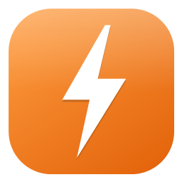
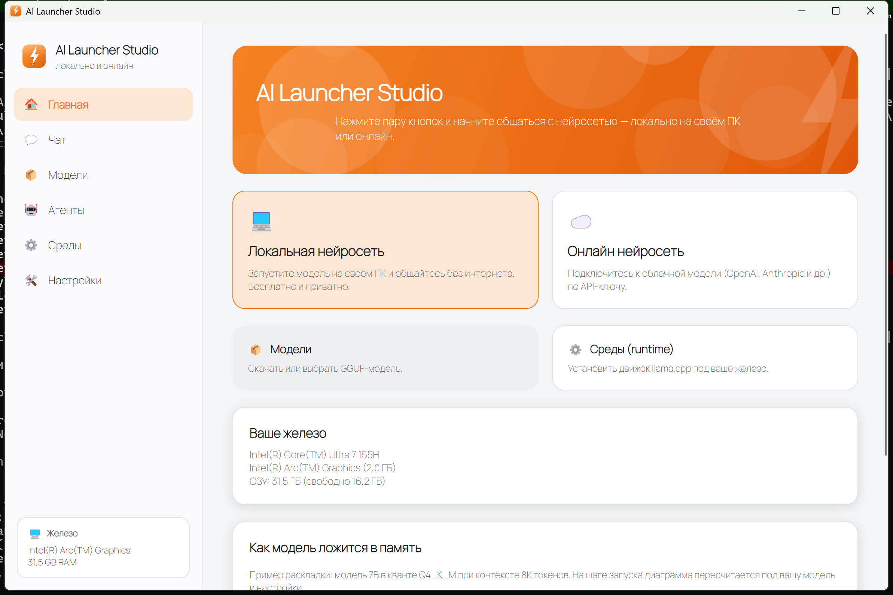
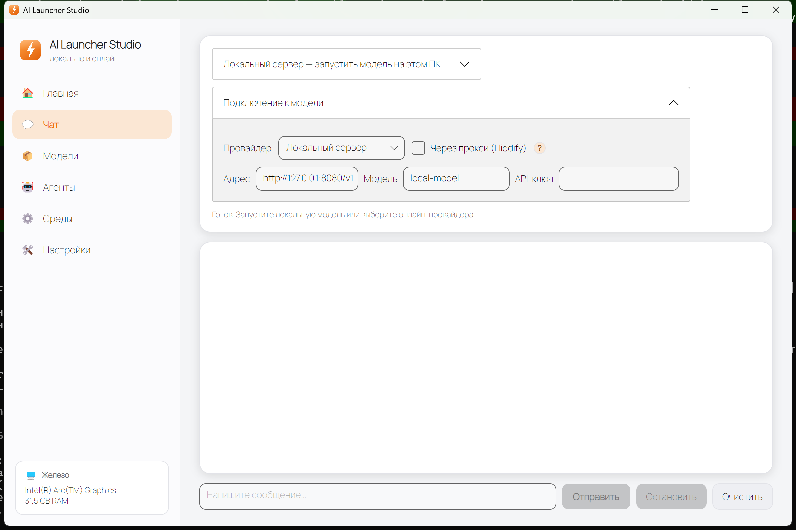
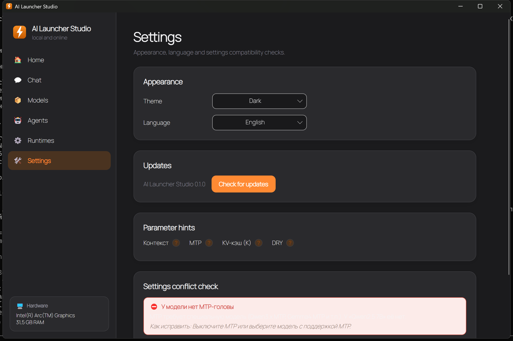
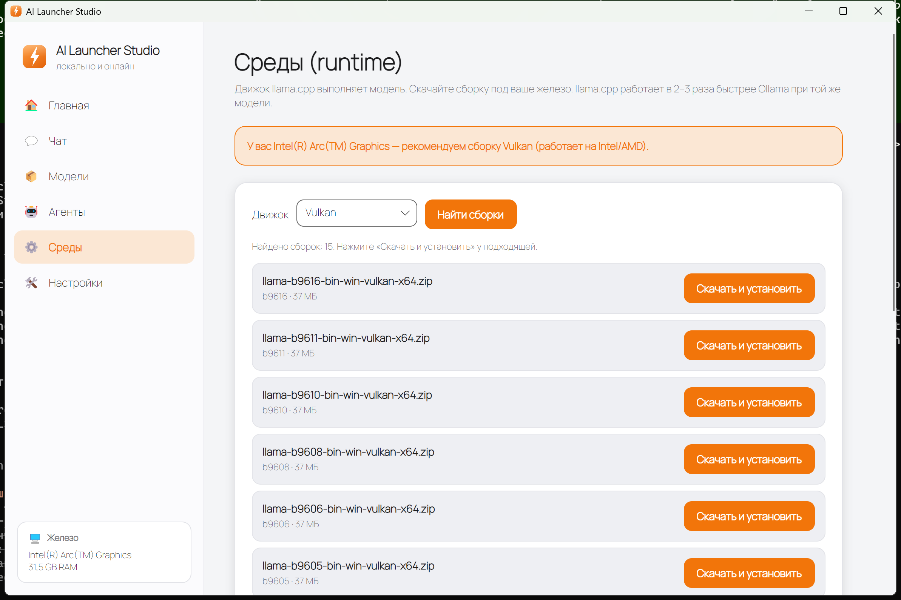
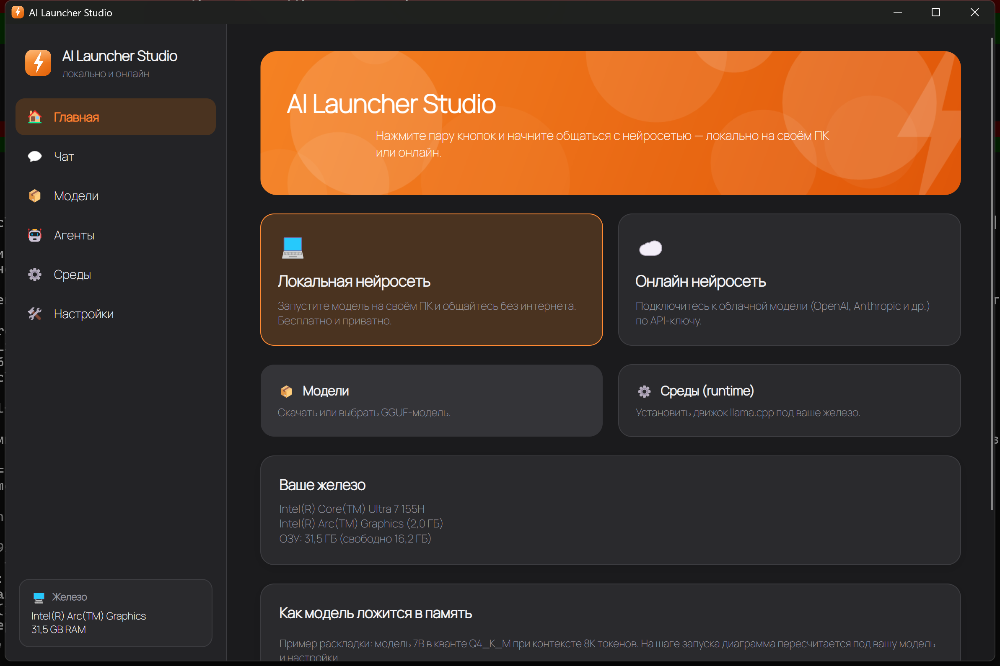

<div align="center">



# AI Launcher Studio

**Запусти нейросеть в пару кликов — локально на своём ПК или онлайн.**
Понятно новичку, мощно для профи.

[](https://github.com/Wetoshkin/AI_Launcher/releases)
[](LICENSE)


[English version](README_en.md)



</div>

---

## ⚡ Что это

**AI Launcher Studio** — десктопное приложение для Windows, которое убирает всю боль запуска локальных и онлайн нейросетей. Без терминала, без возни с Python и флагами. Нажал пару кнопок — и общаешься с моделью: на своём железе (бесплатно и приватно) или через облачного провайдера.

При этом под капотом — все передовые возможности: реальная установка движков `llama.cpp`, наглядная диаграмма памяти, движок проверки конфликтов настроек, анти-зацикливание, мульти-GPU, MoE, reasoning-модели и режим Эксперт с полным контролем.

## 📦 Установка

Скачайте из раздела **[Releases](https://github.com/Wetoshkin/AI_Launcher/releases)**:

- **`AI-Launcher-Studio-Setup-*.exe`** — установщик (без прав администратора, ставит ярлыки, есть удаление). Просто запустите.
- **`AI-Launcher-Studio-portable-*.zip`** — портативная версия (распакуйте и запустите `Launcher.Desktop.exe`).

Отдельно ставить .NET **не нужно** — всё внутри.

## ✨ Возможности

### 💻 Локальная нейросеть на своём ПК
Установите движок `llama.cpp` под ваше железо (CPU / Vulkan / CUDA / ROCm — приложение само рекомендует), выберите GGUF-модель и запустите. Встроенный чат отвечает потоком в реальном времени. Работает и на видеокартах Intel/AMD, а не только NVIDIA.

### ☁️ Онлайн нейросеть
Встроенный чат к **OpenAI**, **OpenRouter**, **Anthropic (Claude)** или своему адресу — по API-ключу. Есть поддержка прокси **Hiddify** для заблокированных провайдеров.

<div align="center"></div>

### 🧠 Диаграмма памяти
Наглядно показывает, **как модель ложится в память** одной или двух видеокарт и системную RAM, и предупреждает, если не помещается — ещё до запуска.

### ⚠️ Проверка конфликтов настроек + подсказки
Движок объясняет простым языком, если настройки несовместимы (MTP без подходящей модели, TurboQuant без нужной сборки, контекст больше нативного, нехватка памяти) — и как это исправить. У **каждого** параметра есть иконка «?» с понятным объяснением: что это, зачем и на что влияет.

<div align="center"></div>

### 📦 Модели и 🤖 Среды
Локальный каталог GGUF и живой поиск на **Hugging Face** с подсветкой динамических квантов (UD-Q4_K_XL). Реальное **скачивание и установка** сборок `llama.cpp` прямо из приложения.

<div align="center"></div>

### 🤖 Кодинг-агенты
Запуск агентов (**OpenCode, Kilo, Claw, Aider**) на локальной или онлайн модели прямо в вашем проекте.

## 🚀 Особенности (то, чего нет у большинства лаунчеров)

- **🚫 Анти-зацикливание** — DRY-сэмплер включён по умолчанию (лучший приём против повторов модели; обычный «штраф за повторы» иногда наоборот усиливает циклы).
- **🎮 Мульти-GPU** — `tensor-split` пропорционально VRAM для конфигов вроде RTX 3090 + RTX 3060.
- **🧩 MoE на CPU** — авто-определяет модели-смеси экспертов (Qwen3 MoE, Mixtral, GLM) и ползунком разгружает экспертов в RAM, чтобы большие MoE влезали в VRAM. Авто-расчёт + ручная настройка.
- **💭 Reasoning-модели** — режим размышлений с бюджетом; блок `<think>` сворачивается в отдельную секцию, ответ остаётся чистым.
- **🎨 Стиль ответов** — Точный (код) / Сбалансированный / Творческий одним кликом.
- **🌗 Светлая и тёмная темы**, **🌍 русский и английский** языки, **🔄 проверка обновлений**.
- **🛠 Режим Эксперт** — поле произвольных аргументов `llama-server` + лог-консоль сервера.

<div align="center"></div>

## 🏁 Быстрый старт

1. **Среды** → «Найти сборки» → «Скачать и установить» рекомендованную (для Intel/AMD — Vulkan, для NVIDIA — CUDA).
2. **Модели** → найдите модель на Hugging Face или укажите папку с готовыми `.gguf`.
3. **Чат** → раздел «Локальный сервер» → выберите модель → «Запустить». Когда статус «готов» — пишите сообщения.

Либо сразу **Чат** → выберите онлайн-провайдера, введите API-ключ и общайтесь.

## 🧱 Архитектура

```text
src/Launcher.Core      сценарии, профили, настройки, decoding-пресеты, подсказки параметров
src/Launcher.Runtimes  llama.cpp runtime, порты, процессы, железо/VRAM, движок конфликтов, диаграмма памяти
src/Launcher.Models    локальный каталог GGUF и поиск/скачивание на Hugging Face
src/Launcher.Agents    запуск и определение кодинг-агентов
src/Launcher.Online    онлайн-провайдеры и стриминговый чат (OpenAI-совместимый и Anthropic)
src/Launcher.Desktop   интерфейс на Avalonia (Главная / Чат / Модели / Агенты / Среды / Настройки)
tests/                 200+ unit-тестов по слоям
```

Технологии: **.NET 8**, **Avalonia UI 12**, шрифт **Manrope**.

## 🔧 Сборка из исходников

```powershell
dotnet restore .\AI-Launcher-Studio.sln
dotnet build   .\AI-Launcher-Studio.sln --no-restore
dotnet test    .\AI-Launcher-Studio.sln --no-build
dotnet run --project src\Launcher.Desktop\Launcher.Desktop.csproj
```

## 📄 Лицензия

[MIT](LICENSE) © Wetoshkin
